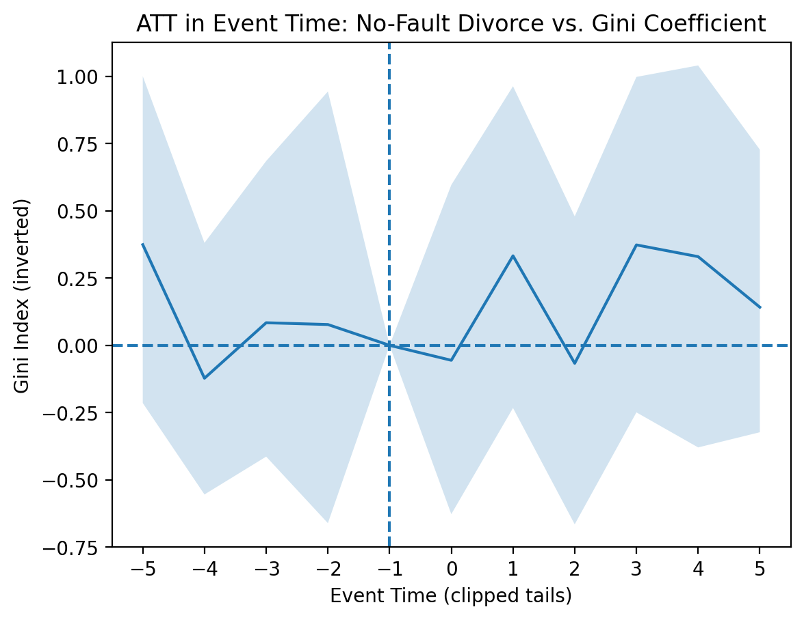
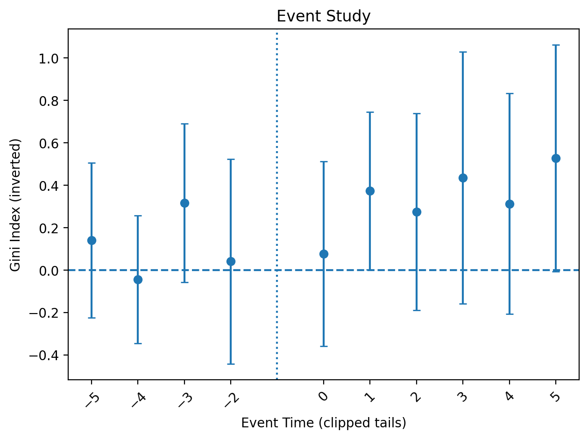

# Divorce-Causal
This repo contains data, an analysis in a Jupyter Notebook, and artifacts (tables and charts) created by running the notebook. 

## Project Summary
- **Question:** Does the passage of "no fault divorce" laws affect national income inequality?
- **Design:** Staggered DiD with country/year FE; clustered SEs by country. Inference uses cluster-robust (sandwich) SEs by country (statsmodels) and a cluster pairs bootstrap over countries as a robustness check.
- **Treatment:** First year of no-fault divorce (see “Treatment Coding”)
- **Outcome:** Gini (0–100), inverted (higher = more equal).
- **Key result:** k=1 ≈ +0.37 points (p≈0.049), k=5+ +.133 points (p≈0.053 (marginal)); 1980s cohort +0.141, 2020s −0.573.
- **Assumptions:** Parallel trends, no anticipation; tails binned.

## Background

This study complements my parallel project, CoResidence Analysis (repo: https://github.com/LittleBiggler/CoResidence)

Exploratory visuals from that work show several features with inflection points in the 1970s–1980s and broad shifts toward households that are (1) older and (2) more often female-headed. During this period, the share of female-headed households rose, average number of children per household fell, and age of inhabitants increased. If household configuration relates to inequality, something important appears to change in the 1970s–1980s.

When I consider shocks that plausibly reshape household structure—illness, job loss, and divorce—divorce stands out as both substantively meaningful, and empirically tractable: adoption years are relatively easy to document across countries. Beyond data availability, a society’s willingness to liberalize divorce is signal-rich, reflecting deep shifts in norms and interpersonal arrangements.

## Results
|   Event Time |   Effect (ATT) |   Observations |   Countries |   P-Value |   T-Value |   Standard Error | 95% CI        |
|-------------:|---------------:|---------------:|------------:|----------:|----------:|-----------------:|:--------------|
|  -5 (tail) |          0.417 |           2050 |          65 |     0.451 |     0.753 |            0.186 | (0.05, 0.78)  |
|           -4 |          0.013 |             65 |          65 |     0.767 |    -0.296 |            0.154 | (-0.29, 0.31) |
|           -3 |          0.335 |             65 |          65 |     0.097 |     1.657 |            0.191 | (-0.04, 0.71) |
|           -2 |          0.012 |             64 |          64 |     0.87  |     0.163 |            0.246 | (-0.47, 0.49) |
| -1 (baseline) |          0     |             63 |          63 |   nan     |   nan     |          nan     | (nan, nan)    |
|            0 |          0.073 |             62 |          62 |     0.735 |     0.338 |            0.222 | (-0.36, 0.51) |
|            1 |     **0.371** |             62 |          62 | **0.049** |     1.967 |            0.189 | (-0.0, 0.74)  |
|            2 |          0.259 |             62 |          62 |     0.248 |     1.156 |            0.237 | (-0.21, 0.72) |
|            3 |          0.386 |             60 |          60 |     0.151 |     1.436 |            0.302 | (-0.21, 0.98) |
|            4 |          0.266 |             59 |          59 |     0.24  |     1.175 |            0.265 | (-0.25, 0.79) |
|   5 (tail) |      **0.133** |           1548 |          58 | **0.053** |     1.931 |            0.273 | (-0.4, 0.67)  |


Here, average treatment effect on the treated (ATT) is shown for each event time, with bootstrap pair CI shaded.



Here, ATT is shown for each event time, with cluster robust CIs (statsmodels)



Significant Cohorts
[Significant Cohorts table](artifact/cohort_table_rounded.csv)
| cohort    |   coefficient |   standard error |     p_value |   t_value |
|:----------|--------------:|-----------------:|------------:|----------:|
| 1980-1989 |      0.141 |        0.065 | 0.031   |   2.154 |
| 2020-2029 |     -0.573 |        0.172   | 0.001 |  -3.334 |


# Conclusion

|   Event Time |   Effect (ATT) |   Observations |   Countries |   P-Value |   T-Value |   Standard Error |
|-------------:|---------------:|---------------:|------------:|----------:|----------:|-----------------:|
|          -5 (tail) |          0.417 |           2050 |          65 |     0.451 |     0.753 |            0.186 |
|           -4 |          0.013 |             65 |          65 |     0.767 |    -0.296 |            0.154 |
|           -3 |          0.335 |             65 |          65 |     0.097 |     1.657 |            0.191 |
|           -2 |          0.012 |             64 |          64 |     0.87  |     0.163 |            0.246 |
|           -1 (baseline) |          0     |             63 |          63 |   nan     |   nan     |          nan     |
|            0 |          0.073 |             62 |          62 |     0.735 |     0.338 |            0.222 |
|            1 |          **0.371** |             62 |          62 |     **0.049** |     1.967 |            0.189 |
|            2 |          0.259 |             62 |          62 |     0.248 |     1.156 |            0.237 |
|            3 |          0.386 |             60 |          60 |     0.151 |     1.436 |            0.302 |
|            4 |          0.266 |             59 |          59 |     0.24  |     1.175 |            0.265 |
|            5 (tail) |          **0.133** |           1548 |          58 |     **0.053** |     1.931 |            0.273 |

## Data & Methods (capsule)
- **Data:** Global country–year panel, years: 1960-2021;
Sources:
- Gini Index, World Bank (https://data.worldbank.org/indicator/SI.POV.GINI), Poverty and Inequality Platform. Data are based on primary household survey data obtained from government statistical agencies and World Bank country departments. Data for high-income economies are mostly from the Luxembourg Income Study database. For more information and methodology, please see pip.worldbank.org
- I compiled no-fault divorce adoption years primarily via Google searches, following links to government sources or (frequently) law-firm explainers aimed at prospective clients. I did not rely on AI overviews. 


## How to Run
```bash
conda env create -f environment.yml
conda activate divorce-did
jupyter lab  # open notebooks/analysis.ipynb

